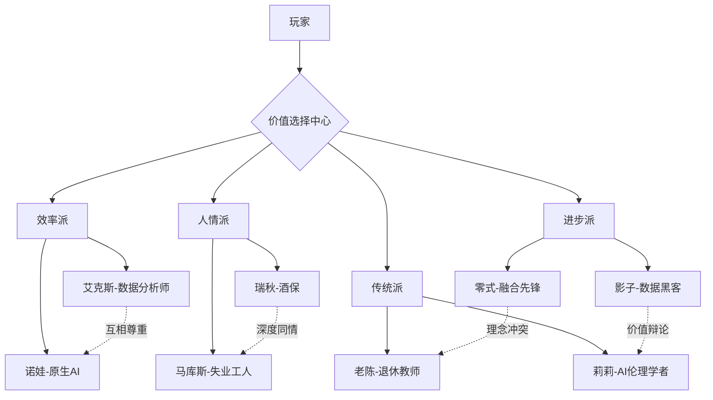

# 角色关系图 - 2035年新弧光城

**文档目的**: 为游戏设计团队提供NPC间的复杂关系网络  
**使用对象**: 正方形、兔子、陶子 (游戏设计团队)  
**更新状态**: 🚧 基础框架完成，待详细补充

---

## 🕸️ **核心关系网络**

### **主要冲突轴线**



---

## ⚡ **动态关系矩阵**

| NPC | 艾克斯 | 诺娃 | 瑞秋 | 零式 | 马库斯 | 莉莉 | 影子 | 老陈 |
|-----|--------|------|------|------|--------|------|------|------|
| **艾克斯** | - | +70 | -30 | +60 | -20 | +30 | +10 | -10 |
| **诺娃** | +70 | - | +20 | +80 | -40 | +60 | +30 | +50 |
| **瑞秋** | -30 | +20 | - | -50 | +80 | +40 | +10 | +90 |
| **零式** | +60 | +80 | -50 | - | -60 | -20 | +50 | -70 |
| **马库斯** | -20 | -40 | +80 | -60 | - | +30 | +20 | +60 |
| **莉莉** | +30 | +60 | +40 | -20 | +30 | - | -40 | +70 |
| **影子** | +10 | +30 | +10 | +50 | +20 | -40 | - | -20 |
| **老陈** | -10 | +50 | +90 | -70 | +60 | +70 | -20 | - |

**数值说明**: -100(完全敌对) ~ +100(完全信任)

---

## 🎭 **关键关系对分析**

### **艾克斯 ↔ 诺娃** (+70) 🤝
- **关系性质**: 理性共鸣
- **互动特点**: 数据驱动的哲学对话
- **冲突点**: 人类理性 vs AI逻辑的微妙差异
- **剧情价值**: 展现人机协作的理想状态

### **瑞秋 ↔ 马库斯** (+80) ❤️
- **关系性质**: 同情与支持
- **互动特点**: 情感支撑和人生指导
- **冲突点**: 如何面对技术变革的态度差异
- **剧情价值**: 代表传统人性价值的坚守

### **零式 ↔ 老陈** (-70) ⚔️
- **关系性质**: 代际价值观冲突
- **互动特点**: 激烈的哲学辩论
- **冲突点**: 进化 vs 传统的根本分歧
- **剧情价值**: 触发玩家对"人类本质"的深度思考

### **影子 ↔ 莉莉** (-40) ⚖️
- **关系性质**: 自由与秩序的对立
- **互动特点**: 价值观辩论和信息交锋
- **冲突点**: 个人自由 vs 社会责任
- **剧情价值**: 探讨信息时代的伦理边界

---

## 🌐 **群体动态效应**

### **联盟形成趋势**

**理性科技联盟** 🤖
- **核心成员**: 艾克斯、诺娃
- **潜在成员**: 零式 (条件性)
- **共同价值**: 效率、逻辑、技术进步
- **对玩家影响**: 支持数据驱动的决策

**人文关怀联盟** ❤️
- **核心成员**: 瑞秋、老陈
- **潜在成员**: 马库斯、莉莉
- **共同价值**: 人性、传统、情感连接
- **对玩家影响**: 强调道德和情感考量

**变革先锋联盟** ⚡
- **核心成员**: 零式、影子
- **潜在成员**: 诺娃 (理念共鸣)
- **共同价值**: 突破、自由、革新
- **对玩家影响**: 鼓励激进的选择

### **分化因素**
1. **技术态度差异** - 对AI和人机融合的不同看法
2. **价值观冲突** - 效率vs人情、进步vs传统
3. **利益相关性** - 职业和生活状况的影响
4. **个人经历** - 过往经历塑造的不同立场

---

## 🎯 **玩家影响机制**

### **关系变化触发**

**微调级 (±20)**
- 触发条件: 日常对话选择
- 影响范围: 单个NPC的态度微调
- 表现形式: 对话语气和内容的细微变化

**重要级 (±50)**
- 触发条件: 关键事件的立场选择
- 影响范围: 影响相关NPC群体
- 表现形式: 剧情分支和新任务的出现

**转折级 (±80)**
- 触发条件: 重大价值观表态
- 影响范围: 整个关系网络重构
- 表现形式: NPC联盟的重新组合

### **群体效应算法**

```python
# 示例: 群体影响计算
def calculate_group_influence(player_action, target_npc):
    base_change = get_direct_relationship_change(player_action, target_npc)
    
    # 计算盟友加成
    ally_bonus = 0
    for ally in get_allies(target_npc):
        if get_relationship(player, ally) > 50:
            ally_bonus += 0.2 * base_change
    
    # 计算敌对惩罚
    enemy_penalty = 0
    for enemy in get_enemies(target_npc):
        if get_relationship(player, enemy) > 50:
            enemy_penalty += 0.3 * base_change
    
    return base_change + ally_bonus - enemy_penalty
```

---

## 🎪 **经典冲突场景设计**

### **场景1: 数据泄露事件**
**触发条件**: 玩家发现政府监控数据
**涉及角色**: 艾克斯、影子、莉莉、瑞秋
**选择分支**:
- 支持公开 → 影子+20, 艾克斯-15, 莉莉+10
- 支持保密 → 艾克斯+15, 影子-25, 瑞秋+10
- 寻求平衡 → 莉莉+15, 其他微调

### **场景2: AI权利抗议**
**触发条件**: 诺娃参与AI权利游行
**涉及角色**: 诺娃、马库斯、莉莉、老陈
**选择分支**:
- 支持AI权利 → 诺娃+30, 马库斯-20, 莉莉+15
- 反对AI权利 → 马库斯+15, 诺娃-30, 老陈+10
- 呼吁理性讨论 → 莉莉+20, 老陈+15, 诺娃+5

### **场景3: 技术伦理辩论**
**触发条件**: 零式的人机融合实验曝光
**涉及角色**: 零式、老陈、莉莉、瑞秋
**选择分支**:
- 支持技术进步 → 零式+25, 老陈-20, 莉莉-10
- 反对危险实验 → 老陈+20, 零式-25, 瑞秋+15
- 要求监管 → 莉莉+25, 零式-10, 老陈+5

---

## 🎨 **视觉呈现建议**

### **关系可视化**
- **亲密关系** (>60): 温暖的金色连线
- **友好关系** (20-60): 绿色连线
- **中性关系** (-20-20): 灰色虚线
- **敌对关系** (<-20): 红色连线

### **动态效果**
- **关系变化**: 连线颜色和粗细的实时变化
- **群体效应**: 相关NPC的同步反应动画
- **冲突激化**: 对立双方的视觉对比强化

---

*本文档为游戏设计团队提供角色关系的完整框架。具体的互动细节和对话内容请参考04_详细档案中的各角色文档。*
